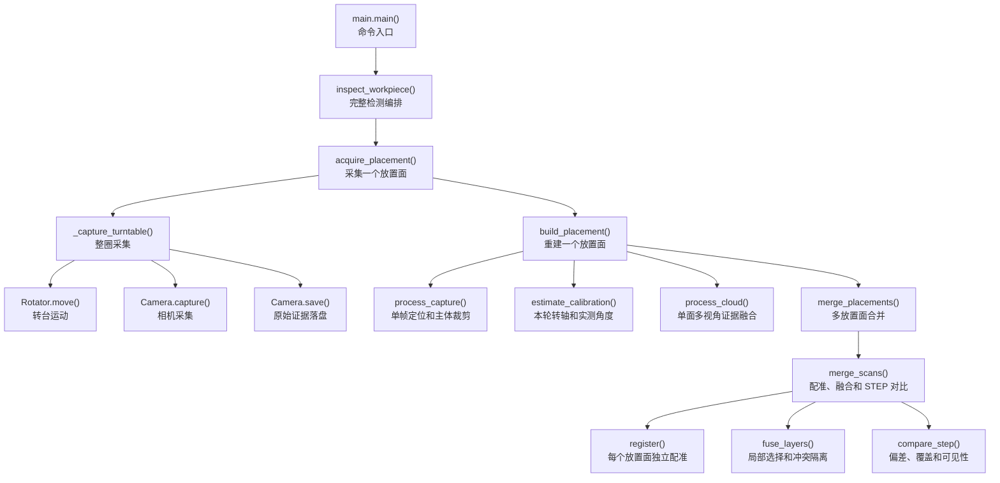

# 精密三维重建系统流程与代码地图

## 主流程



- `inspect`：从采集开始执行完整流程
- `merge`：用当前代码重算已有采集
- `trace`：追查单帧贡献
- `show`：查看结果

## 代码目录与职责

```text
src/
├── camera/
│   ├── feedback/                       # 相机参数学习实验，未接入正式流程
│   │   ├── __init__.py
│   │   ├── agent.py                    # 图像编码器和 SAC 智能体
│   │   └── environment.py              # Gym 环境、质量评分和 mock 相机
│   ├── __init__.py                     # 相机公共接口
│   ├── settings.py                     # 相机参数组
│   └── acquisition.py                  # PyRVC 采集和文件落盘
├── rotator/
│   ├── __init__.py
│   ├── __main__.py                     # 独立 CLI 入口
│   ├── api.py                          # 转台探测和 CLI
│   ├── control.py                      # 伺服控制和安全限制
│   └── protocol.py                     # Modbus RTU 和寄存器
├── inspection/
│   ├── markers/
│   │   ├── __init__.py
│   │   ├── tracking.py                 # 跨帧匹配、角度和质量门禁
│   │   ├── detection.py                # 二维标记检测和三维圆拟合
│   │   ├── calibration.py              # 转台平面、转轴和中心求解
│   │   └── turntable.json              # 默认转台标定
│   ├── geometry/
│   │   ├── __init__.py
│   │   ├── transforms.py               # 转轴旋转和坐标变换
│   │   └── pointcloud.py               # 清洗、体素化、重叠指标和 PLY
│   ├── metrology/
│   │   ├── __init__.py
│   │   ├── model.py                    # STEP 读取和三角化
│   │   ├── trace.py                    # 单帧贡献追踪
│   │   ├── fusion.py                   # 多放置面局部融合
│   │   ├── deviation.py                # 偏差、覆盖、报告和显示
│   │   ├── visibility.py               # CAD 可见性分类
│   │   └── registration.py             # 多起点粗到细 ICP
│   ├── operations/
│   │   ├── __init__.py
│   │   ├── config.py                   # 扫描默认参数
│   │   ├── stages.py                   # 采集、重建和合并阶段
│   │   └── workflow.py                 # 多放置面总流程
│   ├── reconstruction/
│   │   ├── __init__.py
│   │   ├── fusion.py                   # 单面多视角融合
│   │   ├── evidence.py                 # 遮挡和空间连通域证据
│   │   └── observations.py             # 主体裁剪和逐帧证据装载
│   ├── __init__.py
│   ├── viewer.py                       # 点云和图像查看器
│   └── storage.py                      # 历史采集压缩
└── main.py                              # 检测 CLI 和命令分发
```

## 核心算法

### 随机标记跟踪与转台轴线的标定

灰度图先做高斯平滑和固定阈值分割，二值连通域按面积、外接框尺寸和长宽比筛选，图像中心只用于定位组件，真正的三维标记中心来自组件边界点，边界点按临时转轴法向投影到二维平面

$$
q_i=
\begin{bmatrix}
(p_i-\bar p)\cdot e_1\\
(p_i-\bar p)\cdot e_2
\end{bmatrix}
$$

圆拟合先从边界点随机抽取三个点解析求圆，使用固定随机种子执行 160 次 RANSAC，半径限制为 0.25 mm 到 25 mm，点到圆的径向残差不超过 0.20 mm 才计为内点，内点不少于 12 个后使用线性最小二乘重新估计圆心和半径并迭代更新内点

$$
e_i=\left|\lVert q_i-c\rVert_2-r\right|
\qquad
\mathcal I=\{i\mid e_i\leq0.20\}
$$

所有帧的三维圆心合并后通过 SVD 拟合公共转台平面，平面中心为全部圆心的均值，转轴方向取中心化点集最小奇异值对应的右奇异向量

$$
\bar p=\frac{1}{N}\sum_i p_i
\qquad
a=\arg\min_{\lVert n\rVert=1}\sum_i\left((p_i-\bar p)^Tn\right)^2
$$

圆心投影到该平面后，以指令角旋转作为匹配初值，枚举平移候选并使用互为最近邻建立对应，再通过二维 SVD 刚体拟合反复更新旋转和平移，每帧得到从观测帧到参考帧的刚体关系

$$
q_i^{ref}\approx R_kq_i^{obs}+t_k
$$

转台轴心在每帧旋转下保持不动，因此所有成功帧共同满足固定点方程，代码将各帧方程纵向堆叠后用最小二乘求二维轴心，再映射回三维平面

$$
c=R_kc+t_k
\quad\Longrightarrow\quad
(I-R_k)c=t_k
$$

实测角度由二维旋转矩阵计算，同时使用首帧像素到转台平面的 RANSAC 单应性独立计算像素角度进行交叉检查，默认质量门禁要求至少 6 帧、每帧中位匹配数至少 6、最大视角空缺不超过 75 度、平面 RMS 不超过 0.35 mm、轴心方程残差不超过 0.075 mm、单帧拟合 RMS 不超过 0.30 mm、实测角误差不超过 0.25 度

### 标记平面约束与单帧主体的分割

单帧处理不直接沿用上一帧台面位置，而是使用本轮转轴重新检测至少 6 个合格三维标记圆，对标记圆心相对标定轴心的轴向坐标排序，相邻坐标间隔超过 1.50 mm 时切分为新簇，只保留点数最多的连续簇

$$
s_i=(m_i-o)^Ta
\qquad
d=\operatorname{median}(s_i)
\qquad
c=o+da
$$

其中 $o$ 和 $a$ 是本轮标定轴心与单位轴向量，$d$ 是当前帧标记平面相对标定平面的偏移，$c$ 是当前帧台面中心，标记到转轴的径向距离按正交投影计算，小于 10 mm 的近轴误检被拒绝，95% 分位半径乘 0.75 得到主体半径

$$
h_i=(p_i-c)^Ta
\qquad
\rho_i=\left\lVert(p_i-c)-h_ia\right\rVert_2
\qquad
R_{subject}=0.75Q_{0.95}(\rho_{marker})
$$

主体掩码同时要求三维坐标有限、轴向高度位于默认 1 mm 到 80 mm、径向距离不超过主体半径，如果配置了相机 Z 范围还要满足该范围，最终掩码直接作用于有组织点图并保存原始扁平像素索引，因此置信度、法向、图像和深度证据能够在后续阶段精确映射回同一测量点

$$
M_i=\operatorname{finite}(p_i)
\land 1\leq h_i\leq80
\land \rho_i\leq R_{subject}
\land z_{min}\leq p_{i,z}\leq z_{max}
$$

### 多视角几何证据与单面点云融合

第 $k$ 帧点云使用本轮实测角度绕转轴反向旋转到参考姿态，法向使用同一旋转矩阵，相机原点也执行同一刚体变换

$$
p_{k,i}'=o+R(a,-\hat\theta_k)(p_{k,i}-o)
$$

候选点先经过传感器硬门禁，默认置信度不得低于 0.40，配置入射角门槛时还要求视线与法向夹角余弦达到门槛，边缘证据由图像 Sobel 梯度和 Canny、四邻域深度差、四邻域法向变化、局部置信度骤降取并集，默认采用软边缘策略，边缘点不能作为其他视角的独立证据，但边缘点自身可以被非边缘点支持后进入正式点云

对第 $k$ 帧候选点 $p$，只在角度间隔有效的其他帧中查询传感器有效且非边缘目标点的最近邻，默认空间支持半径为 0.15 mm，法向一致性要求绝对点积不小于 0.60，观察侧一致性要求两个相机视向量与源法向点积同号

$$
d_{kj}(p)=\min_{q\in C_j^{eligible}}\lVert p-q\rVert_2
$$

$$
s_{kj}(p)=
\mathbf 1[d_{kj}(p)\leq r_s]
\mathbf 1[|n_k^Tn_j|\geq c_n]
\mathbf 1[(n_k^Tv_k)(n_k^Tv_j)>0]
\mathbf 1[\operatorname{visible}_j(p)]
$$

遮挡判断先将统一姿态中的候选点逆变换到邻帧相机坐标，再按针孔模型投影到深度图，检查投影位置的 $3\times3$ 邻域，只要达到配置数量的深度值比候选点深度小 0.50 mm 以上，该候选点在邻帧中就被视为遮挡

$$
u=f_x\frac{x}{z}+c_x
\qquad
v=f_y\frac{y}{z}+c_y
$$

每个点的独立支持数是所有有效邻帧判定之和，正式点要求支持数达到 $m-1$，其中 $m$ 是所需总视图数

$$
S_k(p)=\sum_{j\neq k}s_{kj}(p)
\qquad
M_{formal}(p)=\mathbf 1[S_k(p)\geq m-1]\land M_{sensor}(p)
$$

该宽支持只用于生成单面配准云，`0.15 mm` 是对应点搜索范围而不是测量精度，尺寸测量另加局部法向一致性，源点与邻帧最近邻沿源法向的距离不超过 `0.05 mm` 才算一次严格一致，源法向无效时退化为欧氏距离

$$
e_{kj}(p)=\left|n_k^T(q_j-p)\right|
\qquad
C_k(p)=\sum_{j\neq k}s_{kj}(p)\mathbf 1[e_{kj}(p)\leq0.05]
$$

可信点要求当前观测再加至少两个严格一致邻帧，也就是至少三个独立视角，候选点只有一个严格一致邻帧，冲突点只有 `0.15 mm` 宽支持但没有严格一致邻帧，单次点没有任何合格邻帧，同一帧无论点数多少都只能贡献一票

$$
M_{trusted}(p)=\mathbf 1[C_k(p)\geq2]\land M_{sensor}(p)
$$

可信点不直接保留某一帧深度，代码将当前点作为零位移观测，把严格一致邻帧相对当前点的法向位移求均值，只沿法向修正深度并保持切向坐标不变，冲突点不参与平均

$$
\bar\Delta_k(p)=
\frac{\sum_j s_{kj}(p)\mathbf 1[e_{kj}(p)\leq0.05]n_k^T(q_j-p)}{C_k(p)+1}
\qquad
p^*=p+\bar\Delta_k(p)n_k
$$

单面输出同时保存 `cloud-trusted`、`cloud-candidate`、`cloud-conflict` 和 `cloud-single`，原 `cloud` 保留为高覆盖配准输入，`cloud-trusted` 作为后续尺寸融合输入

完整传感器证据、至少 6 帧、整圈角度分布规则且中位步长位于 30 度到 65 度时使用两视图确认，其余情况使用三视图确认，最小视角间隔取配置值和中位步长一半的较大值，最大视角间隔取能够保证每一帧都找到 $m-1$ 个支持视角的最小窗口

证据不足的点不直接删除，$S_k(p)=0$、当前点传感器证据失败、同时存在足够可观察邻帧的点先进入噪声候选，噪声候选到正式点云距离大于默认 0.30 mm 才进入噪声点云，否则回到不确定点云，正式点云再执行 DBSCAN，邻域半径为 0.30 mm、最小点数为 4，只保留点数不小于最大连通域 0.5% 的连通域，最后以 0.05 mm 体素内最接近质心的真实测量点作为代表

### 多起点粗到细的迭代最近点配准

STEP 网格均匀采样 80000 个点作为源点云，测量点云作为目标点云，粗层体素尺寸取 $\max(\tau/3,0.25)$ mm，枚举坐标轴排列和符号组合中行列式为正的 24 个右手旋转，用两个点云的质心差初始化平移

$$
t_0=\bar q-R_0\bar p
$$

每个初值先用最大对应距离 $\max(4\tau,4)$ mm 执行 50 次点到点 ICP，再用最大对应距离 $\max(2\tau,2)$ mm 执行 60 次点到面 ICP

$$
E_{p2p}(R,t)=\sum_i\lVert Rp_i+t-q_{\pi(i)}\rVert_2^2
$$

$$
E_{p2l}(R,t)=\sum_i\left[n_{\pi(i)}^T(Rp_i+t-q_{\pi(i)})\right]^2
$$

候选评分同时考虑已匹配点误差和未匹配比例，避免低覆盖候选只依靠少量局部点取得较小 RMSE

$$
J=\operatorname{RMSE}+(1-\operatorname{fitness})d_{max}
$$

粗层候选按评分排序，只保留旋转差大于 1 度或平移差大于 0.25 mm 的至多 6 个独立姿态，细层体素尺寸取 $\max(v/2,0.12)$ mm，每个候选再依次使用 $\max(2\tau,2)$ mm 和 $\max(\tau,0.75)$ mm 两级点到面 ICP 各迭代 80 次

最终候选若满足 $J\leq J_{best}+\max(0.02,0.05J_{best})$，同时相对最佳姿态的旋转差大于 2 度或平移差大于 0.50 mm，就判定为对称歧义并拒绝继续测量，唯一解还必须满足 fitness 不低于 0.20、点到 STEP 距离中位数不超过 $\max(2.5\tau,0.25)$ mm、90% 分位不超过 $\max(7.5\tau,0.75)$ mm

### 模型表面分区与放置面局部融合

每个放置面先用高覆盖配准云求 STEP 刚体位姿，再用同一变换将可信测量云送入局部融合，配准不会因为可信点稀疏而失稳，尺寸统计也不会继续混入只有宽支持的点

每个已独立配准到 STEP 的测量点 $p_i$ 通过三角网格最近点查询得到表面点 $s_i$ 和单位法向 $n_i$，只计算沿 STEP 法向的有符号残差，不使用点到 STEP 的绝对距离评价观测质量，因此真实凸起或凹陷不会因为偏离名义模型而自动降权

$$
r_i=(p_i-s_i)^Tn_i
$$

表面点按空间体素离散，法向按 0.25 的分量步长量化，二者拼接为局部单元键，默认单元尺寸和残差一致阈值由输出体素 $v$ 与公差 $\tau$ 决定

$$
k_i=
\left[
\left\lfloor\frac{s_i}{h}\right\rfloor,
\operatorname{round}\left(\frac{n_i}{0.25}\right)
\right]
$$

$$
h=\max(3v,1.5\tau)
\qquad
\delta=\max(\tau,2v)
$$

每个放置面在每个局部单元内计算残差均值和标准差，局部质量分数由残差散布和有限采样惩罚组成，点数超过 16 后不再继续降低采样惩罚，当前正式流程没有传入独立标定的不确定度或可信质量，因此实际分数只用于记录而不用于跨放置面强制覆盖

$$
\mu_k=\frac{1}{N_k}\sum_{i\in k}r_i
$$

$$
Q_k=
\sqrt{\frac{1}{N_k}\sum_{i\in k}(r_i-\mu_k)^2}
+\frac{v}{\sqrt{\min(N_k,16)}}
$$

同一表面单元内按残差均值从小到大排序，以最大跨度不超过 $\delta$ 的规则形成一致簇，首放置面所在簇作为基准，只有另一个簇获得至少两个独立放置面的支持且支持数严格大于基准簇时才覆盖基准，多个最大簇等票且没有可信质量来源时标记为未决冲突并从正式点云移出

$$
\mathcal C_j=\{k\mid \max_{k\in\mathcal C_j}\mu_k-\min_{k\in\mathcal C_j}\mu_k\leq\delta\}
$$

融合只在胜出簇内部保留原始测量点，未决冲突点单独写入冲突点云，最后在每个输出体素中选择距离体素内质心最近的真实测量点作为 medoid，不计算跨簇平均值

### 双向距离与模型可见性偏差测量

点云到 STEP 的距离用于判断测量点是否偏离名义表面，距离通过三角网格最近点查询直接计算，不是到离散 STEP 采样点的距离

$$
d_{C\rightarrow M}(p)=\min_{x\in M}\lVert p-x\rVert_2
$$

只有 STEP 三角网格同时满足闭合、边流形、点流形、可定向且无自交时才计算有符号距离，$d_s>\tau$ 分类为外凸，$d_s<-\tau$ 分类为内凹，网格拓扑不满足条件时只报告无符号超差，不解释偏差方向

STEP 到点云的距离用于估计认证覆盖率，默认在网格表面均匀采样 300000 个点，对每个模型样本查询可信融合点云最近邻，距离不超过公差 $\tau$ 才记为已观测

$$
d_{M\rightarrow C}(x)=\min_{p\in C}\lVert x-p\rVert_2
$$

$$
\operatorname{coverage}=\frac{1}{N}\sum_{i=1}^{N}\mathbf 1[d_{M\rightarrow C}(x_i)\leq\tau]
$$

未覆盖模型样本不能直接判定为缺料，代码根据每帧实测转角、转轴基底和放置面到 STEP 的刚体变换恢复相机位姿，再将模型样本变换到相机坐标并按针孔模型投影，只有 $z>0$ 且像素位于图像范围内才视为进入该帧视场

$$
p_c=R_{sc}p_s+t_{sc}
\qquad
u=f_x\frac{x_c}{z_c}+c_x
\qquad
v=f_y\frac{y_c}{z_c}+c_y
$$

对视场内样本从相机中心向样本发射射线，三角网格首个交点距离与目标距离之差不超过 $\max(0.20,2\tau)$ mm 才具有直视关系，再检查投影像素 $3\times3$ 邻域是否存在有限且大于零的传感器深度

$$
\operatorname{visible}(x)=
\mathbf 1\left[
\left|t_{hit}-\lVert x-o_c\rVert_2\right|
\leq\max(0.20,2\tau)
\right]
$$

最终分类互斥且完备，已观测表示模型样本附近存在正式点，可见无返回表示射线可达但邻域没有有效深度，可见未入选表示存在有效深度但对应测量未进入正式点云，被遮挡表示进入视场但射线先撞到其他表面，视野外表示没有进入任何相机视场，缺少完整帧证据时统一标记为证据不足
