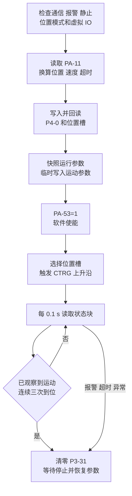

# 转台控制规范

本文是转台的控制基准，协议层、控制层和上层流程均按本文实现

## 系统约定

- 链路：`上位机 -> RS-485 -> 驱动器 -> 转台`
- 接线：驱动器端子 `4=RS485-`、`5=RS485+`
- 协议：Modbus RTU
- 减速比：`1:180`
- 标称重复定位精度：`0.005°`
- 控制接口：直接控制伺服驱动器，不使用独立运动控制器的 RS-232 协议

重复定位精度不作为运动完成判据

## 通信协议

- 默认从机地址：`1`
- 默认串口：`9600 8N2`
- 常规超时：`1 s`
- 常规重试：`1` 次
- 探测超时：`0.5 s`
- 探测重试：`0` 次
- 最大数据长度：`100` 个 16 位字

`PA-71=1` 设置从机地址，`PA-72=96` 设置 `9600 bit/s`，`PA-73=0` 设置 `8N2`，`PA-104=0` 启用 RS-485

RTU 帧格式

```text
[地址 1 byte] [功能码 1 byte] [数据 N byte] [CRC16 低字节] [CRC16 高字节]
```

- 帧间隔不小于 `3.5` 个字符时间
- CRC 初值 `0xFFFF`，多项式 `0xA001`，低字节先发送
- `0x03`：读取保持寄存器
- `0x06`：写单个保持寄存器
- `0x04` 和 `0x10`：协议层可保留，高层不得依赖，使用前必须实机验证
- 空响应、异常响应、数量不符和串口异常均视为失败
- 协议层使用 `pymodbus` 组帧和校验 CRC，业务层不得手工拼帧

自动探测只发送只读请求，候选串口必须恰好有一个设备通过地址、波特率、格式、RS-485 和状态检查，多个匹配设备必须手动指定端口

## 地址与编码

| 参数组 | 地址公式 | 范围 |
| :---: | :---: | :---: |
| `PA-n` 持久地址 | `0x0000+n` | `n=0..105` |
| `PA-n` 临时地址 | `0x0080+n` | `n=0..105` |
| `P3-n` | `0x0100+n` | `n=0..45` |
| `P4-n` | `0x0200+n` | `n=0..39` |
| 状态块 | `0x1000+offset` | `0x1000..0x101B` |

- 单寄存器为 16 位，寄存器内高字节在前
- 有符号 16 位数使用二进制补码
- 32 位和 64 位状态量按低寄存器字在前组合
- 电流和温度缩放未定义，保留原始值
- `PA-n` 持久写入 EEPROM
- `PA-n+0x0080` 临时生效，断电恢复
- 临时 PA 从原始 PA 地址回读，其余写入从写入地址回读，不一致立即终止

运行时速度、转矩、加减速、使能和位置输入方式必须使用临时地址，控制模式、通信错误处置和安全零指令只允许由 `setup` 持久写入

## 关键寄存器

| 参数 | 地址 | 定义 |
| :---: | :---: | :---: |
| `PA-4` | `0x0004` | 控制模式，`0` 位置、`1` 速度、`2` 转矩、`3..5` 混合模式 |
| `PA-11` | `0x000B` | 每电机圈指令脉冲数 |
| `PA-14` | `0x000E` | 位置输入方式，`3` 为内部位置 |
| `PA-16` | `0x0010` | 定位完成范围，`130` 脉冲 |
| `PA-21..24` | `0x0015..0x0018` | JOG、速度来源、最高速度和内部速度 |
| `PA-32` | `0x0020` | 转矩来源，`1` 为内部转矩 |
| `PA-34/35` | `0x0022/0x0023` | CCW/CW 转矩限制，单位为额定转矩百分比 |
| `PA-40..42` | `0x0028..0x002A` | 加速、减速和 S 曲线时间，单位 `ms` |
| `PA-53` | `0x0035` | 软件强制使能 |
| `PA-60/61` | `0x003C/0x003D` | 软重启和报警清除 |
| `PA-64` | `0x0040` | 内部转矩命令 |
| `PA-71..74` | `0x0047..0x004A` | 地址、波特率、串口格式和通信错误处置 |
| `PA-104` | `0x0068` | RS-485 开关，`0` 为启用 |
| `P3-30/31` | `0x011E/0x011F` | 虚拟 IO 模式和状态 |
| `P3-38..45` | `0x0126..0x012D` | 虚拟输入映射 |
| `P4-0` | `0x0200` | 位置命令模式 |
| `P4-2..25` | `0x0202..0x0219` | 八组位置槽 |
| `P4-32..39` | `0x0220..0x0227` | 原点回归参数 |

## 虚拟输入

位置模式使用 `P3-30=2`，`P3-38..45` 定义功能，`P3-31` 写入状态

`P3-44=0x012C`，`P3-45=0x012D`

| DI | 配置 | 状态位 | 功能 |
| :---: | :---: | :---: | :---: |
| DI1 | `22 JOG+` | `0x01` | 正向 JOG |
| DI2 | `23 JOG-` | `0x02` | 反向 JOG |
| DI3 | `28 CTRG` | `0x04` | 位置触发 |
| DI4 | `29 POS0` | `0x08` | 位置槽低位 |
| DI5 | `30 POS1` | `0x10` | 位置槽中位 |
| DI6 | `31 POS2` | `0x20` | 位置槽高位 |
| DI7 | `27 HOLD` 或 `16 CMODE` | `0x40` | 保持或模式切换 |
| DI8 | `33 SHOM` | `0x80` | 原点回归 |

- 位置槽号 `1..8` 减一后写入 `POS0..2`
- `CTRG` 和 `SHOM` 按 `基础状态 -> 置位 -> 基础状态` 产生上升沿
- 退出时必须清零 `P3-31`

## 运动换算

`A` 为转台角度，`V` 为转台角速度，`R` 为减速比，`P` 为 `PA-11`

```text
电机圈数 = A * R / 360
总指令脉冲 = round(电机圈数 * P)
圈数 = trunc(总指令脉冲 / P)
圈内脉冲 = 总指令脉冲 - 圈数 * P
电机转速 = ceil(|V| * R / 6) r/min
预计时间 = |A| / |V| + 加速时间(ms) * 电机转速 / 1_000_000
```

- 最大转台速度：`30°/s`
- 默认转矩限制：`15%`
- 默认加减速时间：`500 ms`
- 默认单次超时：`60 s`
- 等待上限：预计时间加 `3 s`

`move` 使用增量位置，`P4-0=1`，角度不得为零，负角度由负圈数或负圈内脉冲表示，不使用方向位

`goto` 使用多圈绝对位置，`P4-0=0`，仅允许在同一进程成功执行 `home` 后调用，进程重启后必须重新回零

位置槽 `s=1..8`

```text
圈数地址 = 0x0200 + 2 + 3 * (s - 1)
圈内脉冲地址 = 圈数地址 + 1
速度地址 = 圈数地址 + 2
```

圈数范围为 `-30000..30000`，圈内脉冲必须能写入有符号 16 位并满足 `PA-11`，速度为正 `r/min`，写入后必须逐项回读

## 位置运动



`PA-16` 和软件到位门限均为 `130` 脉冲，运动前的位置偏差不得超过 `1000` 脉冲，完成判定必须先观察到速度、当前位置或位置指令发生变化，再连续 `3` 次满足 `|速度| <= 2 r/min` 且 `|位置偏差| <= 130` 脉冲

## 原点与配置

- `P4-32=4/5`：正向或反向寻找编码器单圈绝对零点
- `P4-33=2`：到达参考点后的最终移动
- `P4-34=2`：使用 `SHOM` 触发
- `P4-35=0`：默认停止方式
- `P4-36/37`：高速和低速回零速度
- `P4-38/39`：原点偏移圈数和脉冲数

默认回零不使用外部传感器，`P4-32=0..3` 只有在上层明确确认传感器已接入时才能使用

`setup("position")` 持久写入虚拟 IO、安全零指令、运动限制、内部命令来源、`PA-74=1` 和 `PA-4=0`，`setup("speed")` 写入速度模式，两者均在禁用、零速度和零转矩状态下软重启，只用于安装或配置变更

## 状态与安全

状态块为 `0x1000..0x101B`，共 `28` 个只读寄存器

| 地址 | 数据 |
| :---: | :---: |
| `0x1000` | 电机速度，`r/min` |
| `0x1001..06` | 当前位置、位置指令、位置偏差，三个有符号 32 位数 |
| `0x1007..0C` | 转矩、电流、模式、温度、速度指令和转矩指令 |
| `0x100D..0E` | 单圈转子绝对位置，有符号 32 位 |
| `0x100F..11` | 输入、输出和编码器输入状态 |
| `0x1012` | 母线电压，`V` |
| `0x1013` | 报警码，`0` 为正常 |
| `0x1014..17` | 逻辑版本、继电器、运行和外部电压状态 |
| `0x1018..1B` | 绝对位置，有符号 64 位 |

- `stop()`：写入 `HOLD`，临时清零 `PA-24` 和 `PA-64`，等待停止，不取消使能
- `disable()`：先执行 `stop()`，再临时写 `PA-53=0` 并清零 `P3-31`
- `clear()`：确认静止并执行 `disable()`，向 `PA-61` 临时地址输出 `1 -> 0`，再确认报警清除
- 通信停机不能替代硬件急停或断电回路
- 所有写入失败、报警、超时和校验失败必须终止运动并执行清理

状态变更操作必须携带确认字

- `setup`：`SETUP`
- `enable`：`ENABLE`
- `move`/ `goto`：`MOVE`
- `spin`：`SPIN`
- `home`：`HOME`
- `clear`：`CLEAR`

确认字只防止误调用，不代替状态检查和硬件安全回路

## 报警码

| 代码 | 报警 | 代码 | 报警 | 代码 | 报警 |
| :---: | :---: | :---: | :---: | :---: | :---: |
| `0` | 正常 | `1` | 超速 | `2` | 主电路过压 |
| `3` | 主电路欠压 | `4` | 位置超差 | `5` | 驱动器过热 |
| `6` | 速度放大器饱和 | `7` | 驱动禁止异常 | `8` | 位置偏差计数器溢出 |
| `11` | IPM 模块故障 | `13` | 驱动器或电机过载 | `14` | 制动故障 |
| `18` | 继电器开关故障 | `19` | 抱闸延时错误 | `20` | EEPROM 错误 |
| `21` | FPGA 模块故障 | `23` | 电流采集电路故障 | `29` | 用户转矩过载 |
| `38` | 编码器 EEPROM 通信失败 | `39` | 编码器数据 CRC 错误 | `40` | 不支持的电机型号 |
| `41` | 需要切换电机型号 | `42` | AC 输入电压过低 | `47` | 上电时主电路电压过高 |
| `55` | RS-485 通信地址错误 | `56` | RS-485 通信数据错误 | `57` | RS-485 通信超时 |
